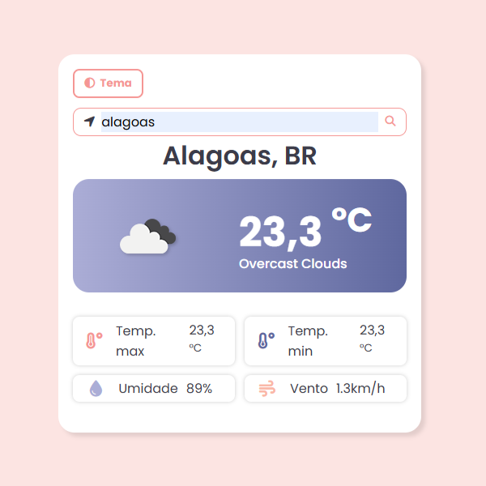
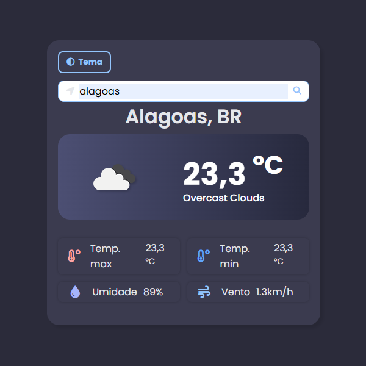

## 🌤️ Site de Previsão do Tempo

Um aplicativo web de clima em tempo real, onde você pode buscar o tempo atual de qualquer cidade do mundo. Desenvolvido com HTML, CSS e JavaScript puro, consumindo dados da API da OpenWeather.

### 🔍 Funcionalidades

- Consulta de clima atual por cidade
- Exibição de temperatura, umidade, vento e descrição do clima
- Ícones de condição climática
- Mudança dinâmica de **tema claro/escuro**
- Integração com uma API de clima (ex: OpenWeatherMap)

### 🛠️ Tecnologias Utilizadas

- HTML5
- CSS3 (com variáveis e grid)
- JavaScript (ES6+)
- Font Awesome (para ícones)
- API: [OpenWeatherMap](https://openweathermap.org/)

## 📸 Demonstração

> Adicione aqui uma imagem ou gif do projeto (modo claro e escuro).
>
> 
> 

## 🧠 O que aprendi

- Trabalhar com requisições assíncronas usando `fetch` e `async/await`
- Manipular DOM dinamicamente
- Tratar erros e validar formulários
- Criar e aplicar temas com CSS (modo escuro)
- Organizar e estilizar interfaces responsivas

---

Feito com 💙 por Gabriela(https://github.com/GabrielaAraujo2)
